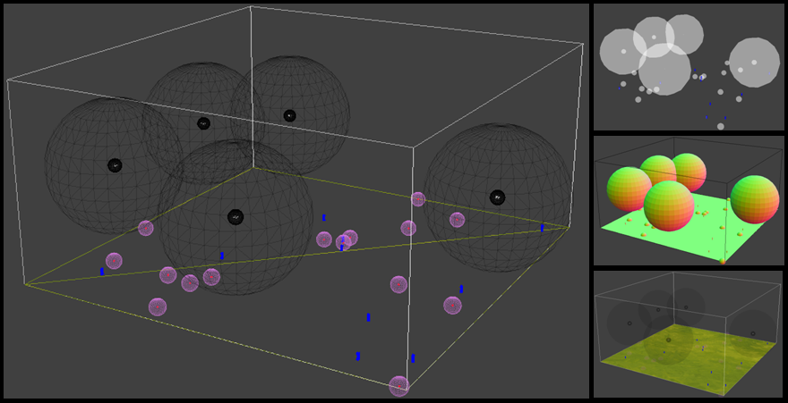

<h1>UAV-Sim</h1>

A framework to simulate UAVs in 3D environment with verious objects like mines, targets etc.

<h2>Key bindings:</h2>
<table border=2>
<tr>
<td>left</td><td>a</td>
<td>right</td><td>d</td>
<td>forward</td><td>w</td>
<td>backward</td><td>s</td></tr>
<tr>
<td>up</td><td>q</td>
<td>down</td><td>x</td>
<td>expand</td><td>e</td>
<td>srink</td><td>r</td></tr>
</table>
<h2>Reward specified in places:</h2>
<ol>
<li>Fighter_UAV
<ul>
<li>movement_reward() --> movement specific</li>
<li>transmission_reward() --> transmission power specific</li>
<li>destruction_reward() --> conflict UAV-2-UAV or Mine-2-UAV</li>
<li>battery_failure_reward() --> crash due to battery failure</li>
</ul>
</li>
<li>Mine
<ul>
<li>update() --> mine detection</li>
</ul></li>
<li>Target
<ul>
<li>update() --> target destruction</li>
</ul></li>
</ol>

<h2>Dependencies</h2>
<ul>
<li>python 3.6+</li>
<li>panda3d</li>
<li>screeninfo, for detecting screen resolution</li>
<li>pillow, for texture manipulation</li>
<li>psutil, for measuring memory usage (<em>optional</em>)</li>
<li>hurry.filesize, for converting bytes to megabytes (<em>optional</em>)</li>
<li>imageio, for recording and converting to gifs (<em>optional</em>)</li>
<li>psd-tools3, for converting .psd files (<em>optional</em>)</li>
<li>blender, for converting .blend files (<em>optional</em>)</li>
</ul>

<em>Optional dependencies must be installed manually.</em>

